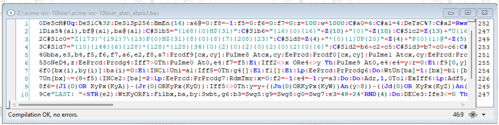
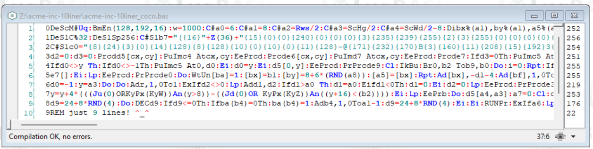

# ACME, inc. (10 LINER)
BASIC 10 liner "acme, inc."

**ACME, inc. (10 LINER)** is a game written in [ugBASIC](https://ugbasic.iwashere.eu) and that runs on various 8-bit home computers. The aim of the game is to make the coyote run for as long as possible, avoiding the barrels that roll towards him. The more barrels you avoid, the higher the score. It is a self-competiting game, and it is designed for one player.

[Click here](/docs/instructions.md) to read the instructions on how to play. 

[Click here](https://spotlessmind1975.itch.io/acme-inc-10liner) to download the executables for the various home computers:
  * **ATARI 400/800** [XEX or ATR format] ([more info](docs/instructions-atari.md))
  * **ATARI XL/XEGS** [XEX or ATR format] ([more info](docs/instructions-atarixl.md))
  * **TRS-80 COLOR COMPUTER 1 AND 2** [DSK format] ([more info](docs/instructions-coco.md))
  * **OLIVETTI PRODEST PC128** [K7 format] ([more info](docs/instructions-pc128op.md))
  
This game joined the ["BASIC10Liner" competition 2024](https://gkanold.wixsite.com/homeputerium).

**ATARI 400/800/XL/XEGS**

**TRS-80 COLOR COMPUTER 1 AND 2**

**OLIVETTI PRODEST PC128**

Since it joined this competition, the game itself is modest in size, the given source code respects strong constraints on the length of each line (category: **EXTREME-256**) and it does not rely on third party libraries. Moreover, since it uses specific features of each home computer, there is a specific ugBASIC source for each one. The check on constraints has been done using [UGBASIC-IDE](https://spotlessmind1975.itch.io/ugbasic-ide).

For those wishing to deepen the details of its implementation, please refer to the commented source code for each specific platform:

  * [source code for ATARI 400/800/XL/XE](/docs/source_atari_atarixl.md).
  * [source code for TRS-80 COLOR COMPUTER 1 AND 2](/docs/source_coco.md).
  * [source code for OLIVETTI PRODEST PC128](/docs/source_pc128op.md).
