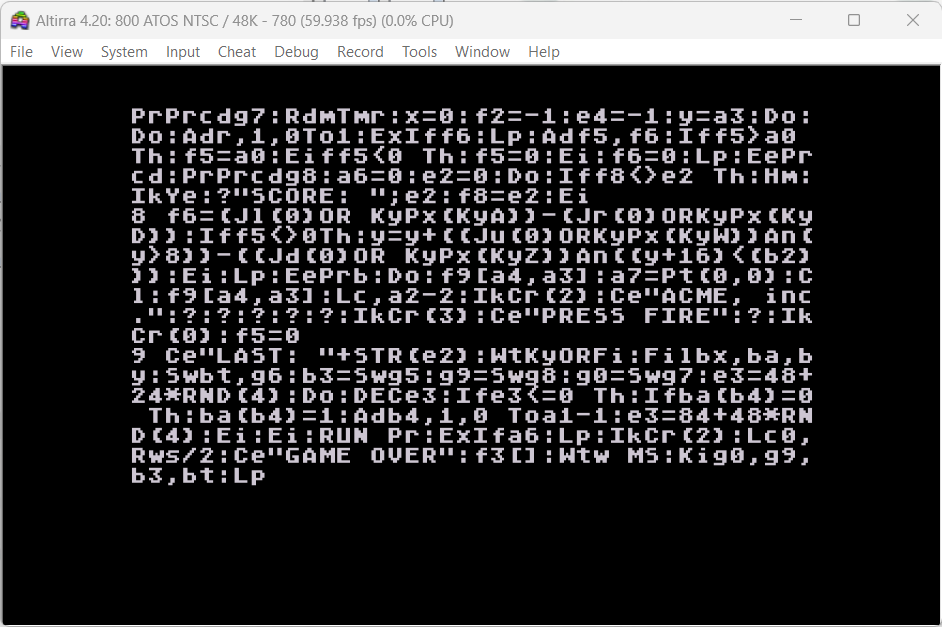
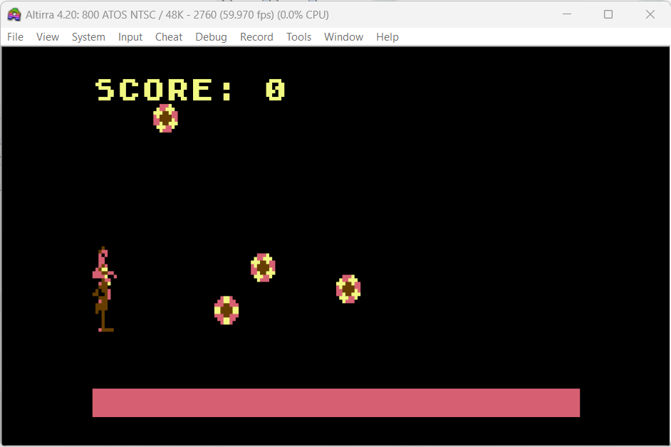

# INSTRUCTIONS

## ATARI XL/XEGS

In order to play this game on an **ATARI XL** or **ATARI XEGS** you need this home computer or to download and install an emulator. The game has been tested with *Altirra version 4.01* .

The emulator can be downloaded [here](https://www.virtualdub.org/altirra.html).

### Loading instructions

Once the emulator software has been installed, follow the instructions below:
 - start **altirra.exe** program;
 - click on **File** > **Boot Image...**
 - select <code>acme-inc-10liner.atarixl.xex</code> file ([click here to download](https://spotlessmind1975.itch.io/acme-inc-10liner));
 - click on **Open**;
 - make sure you have enabled the joystick on port 1.

Alternatively, you can directly perform the command line game, indicating the file as a parameter of the emulator:
 - type <code>acme-inc-10liner.ataricl.xex</code>

### Listing the source code

Note that also an ATR version is given ([click here to download](https://spotlessmind1975.itch.io/acme-inc-10liner-10liner)).

To take part to the BASIC 10Liner Contest, you must be able to consult the source. This is possible thanks to the [ugBASIC](https://ugbasic.iwashere.eu) runtime module, which allows you to show the source with the `LIST` command.

### Running the game

The game can be run by calling the command `RUN`.
