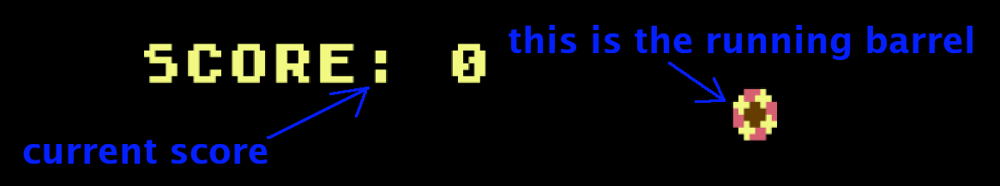
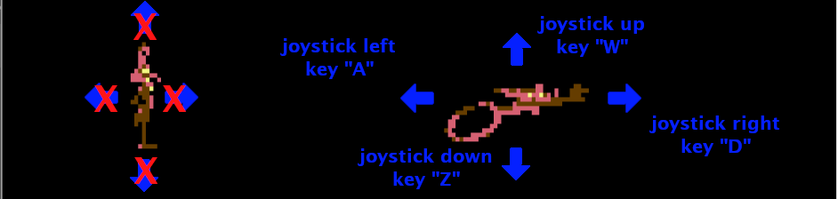
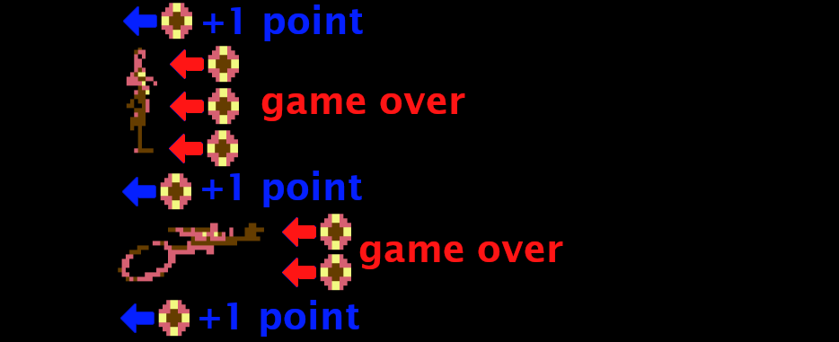

# INSTRUCTIONS

## How to play

In order to play this game you need an original's 8-bit home computer or an emulator, because the game does not work on modern computers. The game has been tried and it works correctly with following computers and emulators:

  * **ATARI 400/800** ([more info](instructions-atari.md))
  * **ATARI XL/XE** ([more info](instructions-atarixl.md))
  * **TRS-80 COLOR COMPUTER 1 AND 2** ([more info](docs/instructions-coco.md))
  * **OLIVETTI PRODEST PC128** ([more info](docs/instructions-pc128op.md))

Once loaded, you can run the game by typing `RUN`.

## The aim

The object of the game is to run as far as you can without touching the rolling barrels that come at the coyote. Your score so far is shown on the left of the screen. When the coyote touches a barrel, the game ends.

## How to move the coyote

In the game you can move the coyote only if it is running. If it stands still, the coyote cannot move. When the coyote stands still, the barrels come at a slower speed. By moving the joystick to the left (or pressing "A") you can slow down the coyote, until it stops running. By moving the joystick to the right (or pressing "D") you can increase the speed of the coyote (and therefore the speed at which the barrels reach you). To avoid the barrels you can move the joystick up (or press "W") or down (or press "Z"). It is not possible to move the coyote if it is still standing.

## How to increase score

To increase your score you need to avoid the barrels, leaving them either above or below the coyote. Only in this way can you score points. On the other hand, if the coyote is hit by a barrel, the game is over.