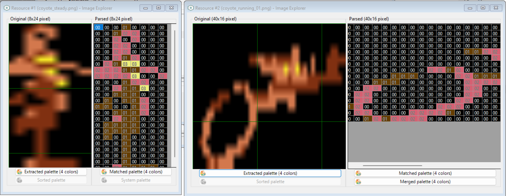
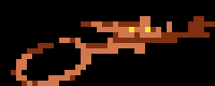
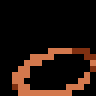

# SOURCE CODE (EXPLAINED)

Below you will find the explained source code of the ATARI / ATARI XL version of the game. The plain file can be read [here](../acme-inc-10liner-plain_atari_atarixl.bas). The source code has been written extensively (without abbreviations), in order to make it easier to understand. Each line has been commented to illustrate how the code works.

## INITIALIZATION (LINES 0-4)

    0 DEFINE SCREEN MODE UNIQUE : DEFINE STRING COUNT 32 : DEFINE STRING SPACE 256

These instructions are specific to [ugBasic](https://ugbasic.iwashere.eu), and they are intended to specify that just only one graphic mode will be used, and the actual space available to strings. The need to indicate this space depends on the fact that the rules oblige the program listing. It follows that, since the runtime module of [ugBasic](https://ugbasic.iwashere.eu) treats the source code like a "string", it is necessary to allocate an adequate amount of space for all computers in order to print it.

    2 BITMAP ENABLE (16)

We ask for a resolution that gives a good number of colors. Let us remember that [ugBasic](https://ugbasic.iwashere.eu) is an isomorphic language. This means that it is not advisable to indicate a specific resolution or color or other characteristics for the graphics you want, but it is given the opportunity to suggest it. Each compiler will decide, according to the limits of hardware, what resolution and color depth of use.

    a6@ = 0 : f8 =-1 : f5 =0 
    f6 = 0 : f7 = 0 : z = 100
    w = 1000

We initialize and define some variables: the game over flag (`a6`), the previous score (`f8`), the actual coyote's speed (`f5`), acceleration (`f6`) and previous speed (`f7`). The variable `z` is used to store the duration for each sound note, while the `w` is intentended to store the pause before restart the game. The last two variables are defined in this way to have more space in sources.

    CONST a0 = 6
    CONST a1 = 4

Now we fix the max coyote's speed (`a0`) and the number of barrels (`a1`). This type of calculations is carried out through the use of the constants (`CONST`) which, in general, allow a better performance and an employment of space equal to zero. 

    DEFINE TASK COUNT 7

Now let's define the space occupied by multithreading, understood as the number of parallel procedures that can run in parallel during the execution of the main program. Currently, they will be 3 fixed and 4 more, one for each barrel.

    CONST a2 = ROWS/2
    CONST a3 = SCREEN HEIGHT/2
    CONST a4 = SCREEN WIDTH/2-8

We calculate various positions related to the center of the screen, expressed as characters (`a2`) or as pixels (`a3`, `a4`).

    DIM r@, a7@

Initialize the number of frame that is currently drawed for the coyote (`r`), and the background color (`a7`), used for collision detection.

    GET IMAGE b FROM 32,32 
	GET IMAGE c FROM 0,0
	GET IMAGE r FROM 16,0

These instructions save a copy of the image designed on the screen by three default areas. These copies are used to clear images from the screen. 

    CONST a8 = SCREEN HEIGHT/8
    CONST b9 = SCREEN WIDTH-1
    CONST b0 = SCREEN HEIGHT-1
    CONST b1 = SCREEN WIDTH-16
    CONST b2 = SCREEN HEIGHT-8

Then, we calculate the maximum number of barrels for the entire height of the screen (`a8`), the maximum width (`b9`) and height (`b0`) minus one, the right (`b1`) and bottom (`b2`) borders.

    DIM bt(a1) AS THREAD, b3 AS THREAD, b4@
    DIM bx%(a1), by%(a1)
    1 DIM a5%(a1), bf@(a1), ba@(a1)

Now, we allocate a set of various variables and arrays: the array of threads (`bt`), the thread identifier for drawing playfield (`b3`), the index to the last activated barrel (`b4`), the coordinates for each barrel (`bx`, `by`), the previous horizontal coordinate for each barrel (`a5`), the current frame displayed for each barrel (`bf`) and, finally, the state of drawing (`ba`).

    CONST STRING b5="{168}{0}H${31}"
    CONST STRING b6="{16}{0}{16}"+Z(10)+"{0}"+Z(10)
    CONST STRING c2=Z(13)+"U{168}{0}{21}@{10}{0}T{0}{1}{1}"
    CONST STRING c8="j{170}{170}{128}{0}{0}{2}{160}{5}{170}UT"
    CONST STRING c1=Z(6)+"{1}@{21}`"+Z(7)+"{153}T"+Z(8)+"H${31}"
    CONST STRING b7="{2}{8}{0}{8}{0}{8}{5}p5{252}{254}{181}z{165}"
    CONST STRING c3="@{0}{1}@"+Z(5)+"{1}@{0}{5}"+Z(6)+"{9}{0}{0}T"
    CONST STRING c9="{8}{0}{24}{2}{0}{9}@{4}@{5}{0}{5}{0}{6}@{27}"
    2 CONST STRING c0="Z{173}^{191}?\{13}P{0}H${31}{8}{0}{8}{7}{208}{23}"
    CONST STRING d8=Z(4)+"*{0}{1}UP{20}"+Z(4)+"P{0}{1}@"+Z(5)+"{1}"
    CONST STRING c4="{192}V{148}U{193}{2}P{6}{176}{10}{128}{34}{144}{160}{144}"
    CONST STRING c5="@{0}{2}{5}@{0}{4}{5}{0}{0}{20}{9}@{1}P{1}UU{0}{0}H${31}"
    CONST STRING c6="{212}V{149}{250}{175}{250}{175}V{149}{23}{212}{7}{208}{0}H${31}"
    CONST STRING d0="{0}{0}{0}{0}{5}U{215}{145}{2}{160}"+Z(5)+"%eZ{170}{168}{0}{0}{1}d{0}"
    CONST STRING d9="({0}{16}"+Z(10)+"{0}"+Z(10)+"{0}"+Z(14)+"{5}{0}{0}{160}{0}{0}{0}{2}{150}{154}{165}{1}{2}{170}"
    3 CONST STRING d7="{10}{144}{6}{128}*{128}*{128}{34}{0}{2}{0}{2}{0}{2}{0}{2}{0}{6}"
    CONST STRING d2=b6+c2+c5
    CONST STRING d3=b7+c0+c6
    CONST STRING d4=c9+c4+d7+b5
    CONST STRING d1=d9+d0+c8+d8+c3+c1

All these string constants are used to maintain the bitmap data of the various graphics elements in the game, using the selected graphic mode, and using a sort of rudimentary compression encoding.

To obtain these representations I started by taking into account the way in which the ATARI graphics chipset maintains color information: in practice, it is a bitmap where each pixel is represented by 2 bits (4 colours). So, I took the source image of a cartoony coyote, shrunk it in size until it was a multiple of 8 pixels wide, then simplified it by selecting 4 colors (black, dark brown, tan, and yellow ). 

Finally, I represented it as an array of hexadecimal values. I did the same with the barrels. These values, plus the 4 final color indices, I composed into a single character string, which I then represented in a single string. One for each graphic resource.

 

To save space, the coyote animation is broken into two frames: one with the entire coyote (`d5`), and the other with just the legs moving (`d6`). The program recomposes the animation by positioning the two frames appropriately. 

 

Barrels are stored directly as a set of two images in (`e7`), and it makes possible to store and draw animation directly.

 

Finally, the steady coyote is encoded with a single image.

All the strings are broken up to improve their arrangement in the 10 lines, and recomposed by means of juxtapositions. Note the use of the `Z(..)` native ugBASIC function, which allows you to generate sequences of zeros as a single string. Currenly, they are bitmap data for: the second frame of running coyote (`d2`), the barrels (`d3`), the steady coyote (`d4`) and, finally, the first frame of running coyote (`d1`).

    d5 := (IMAGE) d1 : e6 := (IMAGE) d2
    e7 := (IMAGES) d3 : e8 : =(IMAGE) d4

With these lines we actually initialize the graphic resources, using the data present in the various strings.

    e9 := NEW IMAGE(8,24)
    e0 := NEW IMAGE(40,16)
    e1 := NEW IMAGE(8,8)

On this occasion, we also allocate some additional space, to speed up the procedures for deleting the screen occupied by the various previously drawn frames.

    e2% = 0: e3% = 0

Initialize the score (`e2`) to zero, and the same for the barrel's spawn time (`e3`).

    GLOBAL x,y,r,z,e8,d5,e6,e4,e9,e0,bx,by,a5,bf,e7,e1
    4 GLOBAL ba,e3,b4,f5,f6,f7,a6,e2,f8,a7

We define a certain set of variables as "global". Global variables can be accessed both by the main program and by any subroutine (procedure).

## USEFUL PROCEDURES (LINES 4-5)

    PROCEDURE f9[cx,cy]
        PUT IMAGE e8 AT cx,cy
    END PROCEDURE

We define a procedure for drawing a "standing" coyote, and which allows us to save precious characters, as it is drawn several times during the game.

    PROCEDURE f0[cx,cy]
        PUT IMAGE e1 AT cx,cy
    END PROCEDURE

We define a procedure for clearing the space occupied by a barrel. Also this procedure will help us to save precious source space, as it is used several times during the game.

    PROCEDURE f1
        IF f7=0 THEN
            PUT IMAGE e9 AT 0,e4
            f7=f5
        ENDIF
        IF f2<>x OR e4<>y THEN
            PUT IMAGE e0 AT 0,e4
            e4=y
        ENDIF
        PUT IMAGE d5 AT 0,y
        IF r=1 THEN
            PUT IMAGE e6 AT 0,y
        ENDIF
    END PROCEDURE

Let's now define a procedure for drawing the running coyote. Although it may seem complicated, it is actually very simple. First, we make sure to delete the coyote that is stationary in the position drawn previously (like y, because like x it is always zero). After that, if it had moved, we delete the previous image. Finally, we draw the first frame of the coyote, which is a "shared" frame between the first and second. Where we need to draw the second frame of the coyote, we overwrite using the smaller frame, so it looks like the legs are moving very quickly.

    PROCEDURE f3
        SOUND NOTE G4,z;NOTE E4,z
        5 SOUND NOTE D4,z
    END PROCEDURE

This procedure will play a sound when the game comes to an end.

    PROCEDURE g4
        IF f7>0 THEN
            PUT IMAGE e0 AT 0,e4
            f7=f5
        ENDIF
        IF f2<>x OR e4<>y THEN
            PUT IMAGE e9 AT 0,e4
            e4=y
            r=0
        ENDIF
        f9[0,y]
    END PROCEDURE

Let's now define a procedure for drawing the standing coyote. First, we make sure to delete the coyote that is running as drawn previously (like y, because like x it is always zero). After that, if it had moved, we delete the previous image. Finally, we draw the only frame of the standing coyote.

## PARALLEL PROCEDURES (LINES 5-8)

    PARALLEL PROCEDURE g5

The first parallel procedure that we are going to define is the one that deals with designing the playing field. This terrain is made up of both barrels and coyote.

        CLS
        INK COLOR(1)
        BAR 0,b2 TO b9,b0
        
First, let's draw the terrain at the bottom of the screen. We use the first of the foreground colors already present and defined by the previous graphic operations, to draw a solid bar.

        DO

This loop will be repeated forever, until the game is over.

            i=0
            REPEAT
                IF ba(i)=1 THEN
                    WAIT VBL by(i)+16
                    f0[a5(i),by(i)]
                    PUT IMAGE e7 FRAME bf(i) AT bx(i),by(i)
                    a5(i)=bx(i)
                ELSEIF fba(i)=2 THEN
                    6 f0[bx(i),by(i)]
                    ba(i)=0
                ENDIF
                INC i
            UNTIL i=a1

The innermost loop takes care of drawing the barrels. In particular, if the barrel is active (`ba(i) = 1`) then it waits for the passage of the video raster to erase the barrel from the previous position and draw it on the next one. After drawing the barrel, the vertical position will be updated accordingly. If the barrel is being erased (`ba(i)=2`), to be recycled, then it will just be erased.

            IF f5=0 THEN
                g4[]
            ELSE
                f1[]
            ENDIF

Depending on the speed of the coyote, it will be drawn moving or stationary.

        LOOP
    END PROCEDURE

    PARALLEL PROCEDURE g6

The second parallel procedure will update the barrel's coordinates, as long as they are inside the screen. 

	DO

This loop will be repeated forever, until the game is over.

		WAIT UNTIL[ba]=1

First of all we wait for this barrel to be activated by the timer. While we wait, we pause the task.

        [bx]=b1
        [by]=8+6*(RND(a8))
        [a5]=[bx]

Let's initialize the position of the barrel, to start from the right edge and a random vertical position.

        REPEAT
            ADD[bx],-f5-1
            ADD[bf],1,0To1
			WAIT UNTIL[bx]=[a5]
			a6=(POINT([bx]-4,[by])<>a7)OR(POINT([bx]-4,[by]+4)<>a7)OR(POINT([bx]-4,[by]+7)<>a7)
		7 UNTIL[bx]<=(8+f5)

The internal loop takes care of updating the horizontal position of the barrel, making it move back towards the coyote at a speed proportional to that of the coyote and, at the same time, updating its frame. The horizontal movement is coordinated with the drawing procedure, so the task pauses until the horizontal position has been updated. Only at that point is a quick check carried out on the possibility that the barrel has impacted the coyote. In this case, the game over flag is set. The movement of the barrel is constant until the left edge is reached.

		INC e2
		[ba]=2

We increase the score and clear the barrel, to make it ready for the next round.

        LOOP
    END PROCEDURE

    PARALLEL PROCEDURE g7

The third parallel routine deals with moving the coyote based on its speed.

	RANDOMIZE TIMER

Initialize the random number generator.

	x=0 : f2=-1 : e4=-1 : y=a3

Let's initialize the position of the coyote.

	DO

This loop will be repeated forever, until the game is over.

		DO
			ADD r,1,0 TO 1
			EXIT IF f6
		LOOP

This internal loop takes care of animating the running coyote. And this animation continues until there is an acceleration of some kind.

		ADD f5,f6
		IF f5>a0 THEN
			f5=a0
		ELSEIF f5<0 THEN
			f5=0
		ENDIF
		f6=0

Acceleration changes speed, and acts like an impulse. If the speed exceeds the maximum allowed, or is less than zero, it is reset to the value in this range.

        LOOP
    END PROCEDURE

    PARALLEL PROCEDURE g8

The last procedure deals with transposing the player's directives, and moving the coyote accordingly. It also will draw the score on the upper part of the screen.

	a6=0 : e2=0

Reset the game over flag (`a6`), and the score (`e2`).

	DO

This loop will be repeated forever, until the game is over.

		IF f8<>e2 THEN
			HOME
			INK YELLOW
			PRINT "SCORE: ";e2
			f8=e2
		ENDIF

If the score has been updated from the previous one, draw it on the higher part of the screen.

		8 f6=(JLEFT(0)OR KEY PRESSED(KEY A))-(JRIGHT(0) OR KEY PRESSED(KEY D))
		IF f5<>0 THEN
			y=y+((JUP(0)OR KEY PRESSED(KEY W))AND(y>8))-((JDOWN(0)OR KEY PRESSED(KEY Z))AND((y+16)<(b2)))
		ENDIF

First of all, we update the acceleration based on the horizontal position of the joystick or the pressing of the `A` and `D` keys. Furthermore, if the coyote is moving, we become reactive to the vertical movement, also carried out either with the joystick or with the keyboard (`W` and `Z` keys).

        LOOP
    END PROC

## GAME LOOP (LINES 8-9)

    DO

This loop will be repeated forever.

        f9[a4,a3] : a7=POINT(0,0)
        CLS : f9[a4,a3]
        LOCATE, a2-2 : INK COLOR(2) : CENTER"ACME, inc."
        PRINT : PRINT : PRINT : PRINT : PRINT 
        INK COLOR(3) : CENTER"PRESS FIRE"
        PRINT : INK COLOR(0) : f5=0 
        9 CENTER"LAST: "+STR(e2)
        WAIT KEY OR FIRE

Let's draw the presentation screen, with the standing coyote, the game title and the request to press a button. We also use these few lines to initialize the speed to zero. We will wait for a `FIRE` or `KE`Y to continue. The coyote will be drawed twice, in order to initialize the palette.

    	FILL bx,ba,by
    
Let's reset the relevant arrays.
    
        SPAWN bt, g6
        b3=SPAWN g5
        g9=SPAWN g8
        g0=SPAWN g7

Let's run the various threads. A certain number are associated with as many elements of the array, and are those that are responsible for updating the position of each individual barrel, while others are nominal.

        e3=48+24*RND(4)
        DO
            DEC e3
            IF e3<=0 THEN
                IF ba(b4)=0 THEN
                    ba(b4)=1
                    ADD b4,1,0 TO a1-1
                    e3=84+48*RND(4)
                ENDIF
            ENDIF
            RUN PARALLEL
            EXIT IF a6
        LOOP

This loop deals with generating one barrel at a time. To do this, a timer (`e3`) is initialized. When this time reaches zero, if the last activated barrel is free, it is activated and the timer resets. However, if there are no free barrels, the check is repeated until there is one free. This loop is also the one that is responsible for activating multitasking, with the call to `RUN PARALLEL`. The loop ends when the game ends.

        INK COLOR(2) : LOCATE 0, ROWS/2 : CENTER "GAME OVER"
        f3[] : WAIT w MILLISECOND

Let's draw the "game over" screen.

	    KILL g0,g9,b3,bt

Remove all threads.

    LOOP
