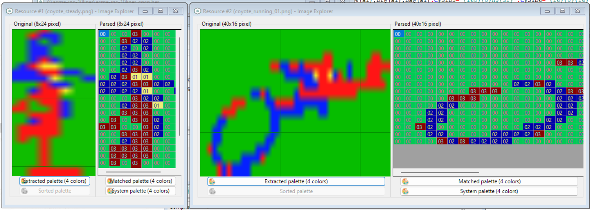
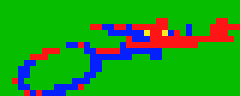
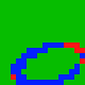
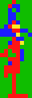

# SOURCE CODE (EXPLAINED)

Below you will find the explained source code of the TRS-80 COLOR COMPUTER 1 and 2 version of the game. The plain file can be read [here](../acme-inc-10liner-plain_coco.bas). The source code has been written extensively (without abbreviations), in order to make it easier to understand. Each line has been commented to illustrate how the code works.

## INITIALIZATION (LINES 0-4)

    0 DEFINE SCREEN MODE UNIQUE 
    
This instruction is specific to [ugBasic](https://ugbasic.iwashere.eu), and it is v intended to specify that just only one graphic mode will be used.

BITMAP ENABLE(128,192,16)

We ask for a resolution that gives a specific resolution and number of colors. Let us remember that [ugBasic](https://ugbasic.iwashere.eu) is an isomorphic language. This means that it is not advisable to indicate a specific resolution or color or other characteristics for the graphics you want, but it is given the opportunity to suggest it. Each compiler will decide, according to the limits of hardware, what resolution and color depth of use.

    w=1000
    CONST a0=6
    CONST a1=8

Now we fix the max coyote's speed (`a0`) and the number of barrels (`a1`). This type of calculations is carried out through the use of the constants (`CONST`) which, in general, allow a better performance and an employment of space equal to zero.  The variable `w` is intentended to store the pause before restart the game, and is defined in this way to have more space in sources.

    CONST a2=ROWS/2
    CONST a3= SCREEN HEIGHT/2
    CONST a4= SCREEN WIDTH/2-8

We calculate various positions related to the center of the screen, expressed as characters (`a2`) or as pixels (`a3`, `a4`).

    DIM bx%(a1),by%(a1),a5%(a1),bf@(a1),ba@(a1)

Now, we allocate a set of various variables and arrays: the coordinates for each barrel (`bx`, `by`), the previous horizontal coordinate for each barrel (`a5`), the current frame displayed for each barrel (`bf`) and, finally, the state of drawing (`ba`).

    DIM r@,a6@,a7@

Initialize the number of frame that is currently drawed for the coyote (`r`), the game over flag (`a6`), and the background color (`a7`) used for collision detection.

    CONST a8= SCREEN HEIGHT/8
    CONST b9= SCREEN WIDTH-1
    CONST b0= SCREEN HEIGHT-1
    CONST b1= SCREEN WIDTH-16
    CONST b2= SCREEN HEIGHT-8

Then, we calculate the maximum number of barrels for the entire height of the screen (`a8`), the maximum width (`b9`) and height (`b0`) minus one, the right (`b1`) and bottom (`b2`) borders.

    DIM bt(a1) AS THREAD,b3 AS THREAD, b4@

Now, we allocate a set of various variables and arrays: the array of threads (`bt`), the thread identifier for drawing playfield (`b3`) and the index to the last activated barrel (`b4`).

    CONST b5=8
    CONST b6=8

We define the height and width of a barrel, in pixel.

    DEFINE TASK COUNT a1+3

Now let's define the space occupied by multithreading, understood as the number of parallel procedures that can run in parallel during the execution of the main program. Currently, they will be 3 fixed and `a1` more, one for each barrel.

    DEFINE STRING COUNT 32 : DEFINE STRING SPACE 256

These instructions are specific to [ugBasic](https://ugbasic.iwashere.eu), and they are intended to specify the actual space available to strings. The need to indicate this space depends on the fact that the rules oblige the program listing. It follows that, since the runtime module of [ugBasic](https://ugbasic.iwashere.eu) treats the source code like a "string", it is necessary to allocate an adequate amount of space for all computers in order to print it.

    1 CONST STRING b7="({16}"+Z(36)+"{15}{0}{0}{240}{0}{0}{0}{3}{235}{239}{255}{2}{3}{255}{0}{0}{0}{0}{10}{170}}{178}{3}{240}{0}{0}{0}{0}{0}:{191}{255}{255}{252}{0}{0}{2}{184}{0}{191}{255}{255}{192}{0}{0}{3}{240}{10}{255}{170}{168}{0}{0}{0}{0}?{0}{2}{170}{160}({0}{0}{0}{0}{160}{0}{2}{128}{0}{0}{0}{0}{0}{2}{128}{0}{2}{128}{0}{0}{0}{0}{0}{2}{128}{0}{10}{0}{0}{0}{0}{0}{0}{14}{0}{0}{168}{0}{0}{0}{0}{0}{0}{2}{128}*{176}{0}{0}{0}{0}{0}{0}{0}{238}{168}"
    CONST STRING c8="{16}{16}"+Z(34)+"{170}{252}{0}*{128}{15}{0}{168}{0}{2}{2}{128}{0}{3}{10}{128}{0}{8}{10}{0}{0}({14}{128}{2}{160}{2}{170}{170}"
    CONST STRING c9="{2}{8}{0}{8}{8}{15}{208}{31}TV{159}{218}{175}{250}{167}{246}{149}{21}{244}{7}{240}{8}{8}{13}p=|{254}{191}Z{165}Z{165}{254}{191}=|{13}p"
    2 CONST STRING c0="{8}{24}{3}{0}{14}{128}{8}{128}{10}{0}{10}{0}{11}{128}-@{171}{232}{170}B{3}{160}{11}{208}{15}{192}3{224}{240}{224}{15}{224}{11}{192}?{192}?{192}3{0}{3}{0}{3}{0}{3}{0}{3}{0}{15}{252}"

All these string constants are used to maintain the bitmap data of the various graphics elements in the game, using the selected graphic mode, and using a sort of rudimentary compression encoding.

To obtain these representations I started by taking into account the way in which the MOTOROLA 6847 graphics chipset maintains color information: in practice, it is a bitmap where each pixel is represented by 2 bits (4 colours), that represent a specific color. So, I took the source image of a cartoony coyote, shrunk it in size until it was a multiple of 8 pixels wide, then simplified it by assigning the fixed 4 colors to the original one.

Finally, I represented it as an array of hexadecimal values. I did the same with the barrels. I composed all values into a single character string, which I then represented in a single string. One for each graphic resource.

 

To save space, the coyote animation is broken into two frames: one with the entire coyote (`c1`), and the other with just the legs moving (`c2`). The program recomposes the animation by positioning the two frames appropriately. 

 

Barrels are stored directly as a set of two images in (`c3`), and it makes possible to store and draw animation directly.

 

Finally, the steady coyote is encoded with a single image.

All the strings are broken up to improve their arrangement in the 10 lines, and recomposed by means of juxtapositions. Note the use of the `Z(..)` native ugBASIC function, which allows you to generate sequences of zeros as a single string. Currenly, they are bitmap data for: the second frame of running coyote (`c2`), the barrels (`c3`), the steady coyote (`c4`) and, finally, the first frame of running coyote (`c1`).

    c1 := (IMAGE)b7 : c2 := (IMAGE)c8
    c3 := (IMAGES)c9 : c4 := (IMAGE)c0

With these lines we actually initialize the graphic resources, using the data present in the various strings.

    c5 := NEW IMAGE(8,24)
    c6 := NEW IMAGE(40,16)
    d7 := NEW IMAGE(8,8)

On this occasion, we also allocate some additional space, to speed up the procedures for deleting the screen occupied by the various previously drawn frames.

    d8%=0 : d9%=0

Initialize the score (`d8`) to zero, and the same for the barrel's spawn time (`d9`).

    GLOBAL x,y,r,c4,c1,c2,d0,c5,c6
    GLOBAL bx,by,a5,bf,c3,d7,ba,d9,b4,d1,d2,d3,a6,d8,d4,a7

We define a certain set of variables as "global". Global variables can be accessed both by the main program and by any subroutine (procedure).

    a6=0 : d4=-1 : d1=0
    3 d2=0 : d3=0

We initialize and define some variables: the game over flag (`a6`), the previous score (`d4`), the actual coyote's speed (`d1`), acceleration (`d2`) and previous speed (`d3`). 

## USEFUL PROCEDURES (LINE 4)

    PROCEDURE d5[cx,cy]
        PUT IMAGE c4 AT cx,cy
    END PROCEDURE

We define a procedure for drawing a "standing" coyote, and which allows us to save precious characters, as it is drawn several times during the game.

    PROCEDURE e6[cx,cy]
        PUT IMAGE d7 AT cx,cy
    END PROCEDURE

We define a procedure for clearing the space occupied by a barrel. Also this procedure will help us to save precious source space, as it is used several times during the game.

    PROCEDURE e7
        IF d3=0 THEN
            PUT Imc 5 AT 0,d0
            d3=d1
        ENDIF
        IF d0<>y THEN
            IF d0<>-1 THEN
                PUT IMAGE c6 AT 0,d0
            ENDIF
            d0=y
        ENDIF
        PUT IMAGE c1 AT 0,y
        IF r=1 THEN
            PUT Imc 2 AT 0,y
        ENDIF
    END PROCEDURE

Let's now define a procedure for drawing the running coyote. Although it may seem complicated, it is actually very simple. First, we make sure to delete the coyote that is stationary in the position drawn previously (like y, because like x it is always zero). After that, if it had moved from the very start position, we delete the previous image. Finally, we draw the first frame of the coyote, which is a "shared" frame between the first and second. Where we need to draw the second frame of the coyote, we overwrite using the smaller frame, so it looks like the legs are moving very quickly.

    PROCEDURE e8
        IF d3>0 THEN
            PUT IMAGE c6 AT 0,d0
            d3=d1
        ENDIF
        4 IF d0<>y THEN
            IF d0<>-1 THEN
                PUT IMAGE c5 AT 0,d0
            ENDIF
            d0=y
        ENDIF
        d5[0,y]
    END PROCEDURE

Let's now define a procedure for drawing the standing coyote. First, we make sure to delete the coyote that is running as drawn previously (like y, because like x it is always zero). After that, if it had moved, we delete the previous image. Finally, we draw the only frame of the standing coyote.

## PARALLEL PROCEDURES (LINES 4-8)

PARALLEL PROCEDURE e9

The first parallel procedure that we are going to define is the one that deals with designing the playing field. This terrain is made up of both barrels and coyote.

	CLS
	INK BLUE
	Br0,b2 TO b9,b0

First, let's draw the terrain at the bottom of the screen. We use the background color already present and defined by the previous graphic operations, to draw a solid bar.

    DO

This loop will be repeated forever, until the game is over.

        i=0
        REPEAT
            IF ba(i)=1 THEN
                WAIT VBL by(i)+16
                e6[a5(i),by(i)]
                PUT IMAGE c3 FRAME bf(i) AT bx(i),by(i)
                a5(i)=bx(i)
            ELSEIF ba(i)=2 THEN
                e6[bx(i),by(i)]
                ba(i)=0
            ENDIF
            INCi
        UNTIL i=a1

The innermost loop takes care of drawing the barrels. In particular, if the barrel is active (`ba(i) = 1`) then it waits for the passage of the video raster to erase the barrel from the previous position and draw it on the next one. After drawing the barrel, the vertical position will be updated accordingly. If the barrel is being erased (`ba(i)=2`), to be recycled, then it will just be erased.

        IF d1=0 THEN
            e8[]
        ELSE
            5 e7[]
        ENDIF

Depending on the speed of the coyote, it will be drawn moving or stationary.

        LOOP
    END PROCEDURE

    PARALLEL PROCEDURE e0

The second parallel procedure will update the barrel's coordinates, as long as they are inside the screen. 

    	DO

This loop will be repeated forever, until the game is over.

	    	WAIT UNTIL[ba]=1

First of all we wait for this barrel to be activated by the timer. While we wait, we pause the task.

            [bx]=b1
            [by]=8+6*(RND(a8))
            [a5]=[bx]

Let's initialize the position of the barrel, to start from the right edge and a random vertical position.

            REPEAT
                ADD [bx],-d1-4
                ADD [bf],1,0 TO 1
                WAIT UNTIL[bx]=[a5]
                a6=(POINT([bx]-4,[by])<>a7)OR(POINT([bx]-4,[by]+4)<>a7)OR(POINT([bx]-4,[by]+7)<>a7)
            UNTIL[bx]<=(8+d1)

The internal loop takes care of updating the horizontal position of the barrel, making it move back towards the coyote at a speed proportional to that of the coyote and, at the same time, updating its frame. The horizontal movement is coordinated with the drawing procedure, so the task pauses until the horizontal position has been updated. Only at that point is a quick check carried out on the possibility that the barrel has impacted the coyote. In this case, the game over flag is set. The movement of the barrel is constant until the left edge is reached.

            INC d8
            [ba]=2

We increase the score and clear the barrel, to make it ready for the next round.

        LOOP
    END PROCEDURE

The third parallel routine deals with moving the coyote based on its speed.

    PARALLEL PROCEDURE e1

        x=0 : e2=-1
        6 d0=-1 : y=a3

Let's initialize the position of the coyote.

    	DO

This loop will be repeated forever, until the game is over.

            DO
                ADD r,1,0 TO 1
                EXIT IF d2<>0
            LOOP

This internal loop takes care of animating the running coyote. And this animation continues until there is an acceleration of some kind.

            ADD d1,d2
            IF d1>a0 THEN
                d1=a0
            ELSEIF d1<0 THEN
                d1=0
            ENDIF
            d2=0

Acceleration changes speed, and acts like an impulse. If the speed exceeds the maximum allowed, or is less than zero, it is reset to the value in this range.

        LOOP
    END PROCEDURE

    PARALLEL PROCEDURE e3

The last procedure deals with transposing the player's directives, and moving the coyote accordingly. It also will draw the score on the upper part of the screen.

        a6=0 : d8=0

Reset the game over flag (`a6`), and the score (`d8`).

        DO

This loop will be repeated forever, until the game is over.

            IF d4<>d8 THEN
                HOME
                INK BLUE
                PRINT "SCORE: ";d8
                d4=d8
            ENDIF

If the score has been updated from the previous one, draw it on the higher part of the screen.

            d2=2*((JLEFT(0)OR KEY PRESSED(KEY A))-(JRIGHT(0) OR KEY PRESSED (KEY D)))
            IF d1<>0 THEN
                7 y=y+4*(((JUP(0) OR KEY PRESSED(KEY W))AND(y>8))-((JDOWN(0)OR KEY PRESSED(KEY Z))AND((y+16)<(b2))))
            ENDIF

First of all, we update the acceleration based on the horizontal position of the joystick or the pressing of the `A` and `D` keys. Furthermore, if the coyote is moving, we become reactive to the vertical movement, also carried out either with the joystick or with the keyboard (`W` and `Z` keys).

        LOOP
    END PROC

## GAME LOOP (LINE 8)

    DO

This loop will be repeated forever.

        d5[a4,a3] : a7=0
        CLS : d5[a4,a3]
        LOCATE,a2-2 : INK RED : CENTER"ACME, inc."
        PRINT : PRINT : PRINT : PRINT : PRINT
        INK YELLOW: CENTER"PRESS FIRE"        
        PRINT : INK BLUE : CENTER"LAST: "+STR(d8)
        WAIT KEY OR FIRE
        
Let's draw the presentation screen, with the standing coyote, the game title and the request to press a button. We also use these few lines to initialize the speed to zero. We will wait for a `FIRE` or `KE`Y to continue. The coyote will be drawed twice to be sure that there will be no flickering.

        FILL bx, ba, by

Let's reset the relevant arrays.

        SPAWN bt, e0
        b3=SPAWN e9
        e4=SPAWN e3
        f5=SPAWN e1

Let's run the various threads. A certain number are associated with as many elements of the array, and are those that are responsible for updating the position of each individual barrel, while others are nominal.

        8 d9=24+8*RND(4)
        DO
            OP_DEC d9
            IF d9<=0 THEN
                IF ba(b4)=0 THEN
                    ba(b4)=1
                    ADD b4,1,0 TO a1-1
                    d9=24+8*RND(4)
                ENDIF
            ENDIF
            RUN PARALLEL
            EXIT IF a6
        LOOP

This loop deals with generating one barrel at a time. To do this, a timer (`d9`) is initialized. When this time reaches zero, if the last activated barrel is free, it is activated and the timer resets. However, if there are no free barrels, the check is repeated until there is one free. This loop is also the one that is responsible for activating multitasking, with the call to `RUN PARALLEL`. The loop ends when the game ends.

        INK COLOR(2) : LOCATE 0,ROWS/2 : CENTER"GAME OVER"
        WAIT w MILLISECOND

Let's draw the "game over" screen.

        KILL f5,e4,b3,bt

Remove all threads.

        RANDOMIZE TIMER

Initialize the number generator.

        d1=0

Reset coyote's speed.

    LOOP
    9 REM just 9 lines! ^_^
