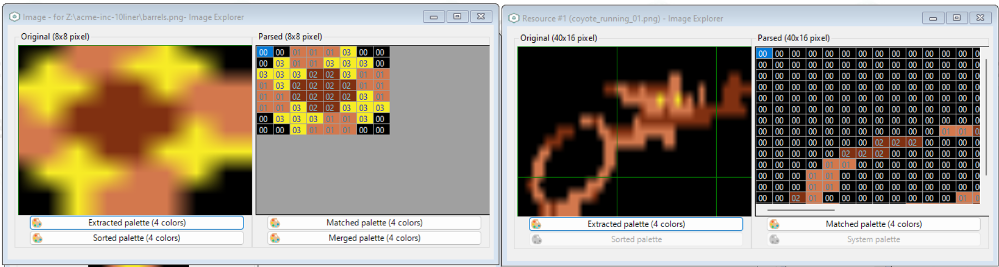

# SOURCE CODE (EXPLAINED)

Below you will find the explained source code of the OLIVETTI PRODEST PC128  version of the game. The plain file can be read [here](../acme-inc-10liner-plain_pc128op.bas). The source code has been written extensively (without abbreviations), in order to make it easier to understand. Each line has been commented to illustrate how the code works.

## INITIALIZATION (LINES 0-3)

    0 DEFINE SCREEN MODE UNIQUE : DEFINE STRING COUNT 32 : DEFINE STRING SPACE 256

These instructions are specific to [ugBasic](https://ugbasic.iwashere.eu), and they are intended to specify that just only one graphic mode will be used, and the actual space available to strings. The need to indicate this space depends on the fact that the rules oblige the program listing. It follows that, since the runtime module of [ugBasic](https://ugbasic.iwashere.eu) treats the source code like a "string", it is necessary to allocate an adequate amount of space for all computers in order to print it.

    BITMAP ENABLE (16)

We ask for a resolution that gives a good number of colors. Let us remember that [ugBasic](https://ugbasic.iwashere.eu) is an isomorphic language. This means that it is not advisable to indicate a specific resolution or color or other characteristics for the graphics you want, but it is given the opportunity to suggest it. Each compiler will decide, according to the limits of hardware, what resolution and color depth of use.

    w=1000 

The variable `w` is intentended to store the pause before restart the game, and is defined in this way to have more space in sources.

    CONST a3 = ROWS/2
    CONST a4 = SCREEN HEIGHT/2
    CONST a5 = SCREEN WIDTH/2-8

We calculate various positions related to the center of the screen, expressed as characters (`a2`) or as pixels (`a3`, `a4`).

    DIM bx%(10),by%(10),a6%(10),bf@(10),ba@(10)

Now, we allocate a set of various variables and arrays: the coordinates for each barrel (`bx`, `by`), the previous horizontal coordinate for each barrel (`a6`), the current frame displayed for each barrel (`bf`) and, finally, the state of drawing (`ba`).

    DIM r@,a7@,a8@

Initialize the number of frame that is currently drawed for the coyote (`r`), the game over flag (`a7`), and the background color (`a8`) used for collision detection.

    CONST b9 = SCREEN WIDTH-1
    CONST b0 = SCREEN HEIGHT-1
    CONST b1 = SCREEN HEIGHT-16

Then, we calculate the maximum width (`b9`) and height (`b0`) minus one, and the right (`b1`) border.

    DIM bt(10) AS THREAD, b2@

Now, we allocate a set of various variables and arrays: the array of threads (`bt`), and the index to the last activated barrel (`b2`).

    DEFINE TASK COUNT 13

Now let's define the space occupied by multithreading, understood as the number of parallel procedures that can run in parallel during the execution of the main program. Currently, they will be 3 fixed and 10 more, one for each barrel.

    CONST e = "{0}{0}{0}{0}"
    CONST f = "{0}{0}{0}{0}{0}"
    CONST g = "{0}{0}{0}{0}{0}{0}"
    1 CONST h = "{0}{0}{0}{0}{0}{0}{0}"
    CONST STRING b4 = "{0}{16}{16}"+Z(34)+"{17}{34}{0}{1}{16}{0}{0}{17}{0}{0}{0}{16}{0}{0}{0}{16}"+f+"{1}{0}{16}{0}{17}{0}{17}{17}"+Z(35)+"{17} {0}{17}{0}{34}{0}{16}{0}{1}{1}{0}{0}{2}{17}{0}{0}{16}{17}{0}{0}{16}!{0}{1}{0}{1}{17}{17}"
    CONST STRING b5 ="{2}{8}{0}{0}{8}{8}{0}{19}{3}33#{19}{34}{17}{34}{17}#{3}{17}{0}{17}{17}{0}{17}02{17}{34}{17}{34}123301{0}{0}{8}{8}{0}1{1}1{17}!3{34}3{34}{17}!{1}1{0}1{19}{0}{19}{16}{18}{17}{34}3{34}3{18}{17}{19}{16}{19}"
    b7 := (IMAGE)b4
    c8 := (IMAGES)b5
    2 CONST STRING b3 = "{0}({16}"+Z(39)+"{34}"+e+"!!{34}{0}{0}{34}"+f+"{17}1!{0}{34}"+f+"{2}{18}{17}{34}{34}{0}{0}{0}{18}{0}{18}{34}{34} {0}{0}{0}{34}{0}{34}{17}{17}"+e+"{2}{0}{0}{17}{17}{1}"+e+"{17}{0}{0}{16}"+g+"{16}{0}{0}{16}"+g+"{16}"+Z(11)+"{17}"+h+"{16}{1}{18}"+h+"!{17}"+Z(43)+"{17}"+g+"{2}{18}{34}{17}{1}{2}{34}"+e+"{17}{17}{19}{1}{2}"+g+"{17}{17}{34}{34} {0}{0}{1}{16}{0}{34}{34}{34}{0}{0}{0}{2}{0}{17}{34}{17}{16}"+e+"{34}{0}{1}{17}{0}{16}"+g+"{1}"+g+"{1}{0}{0}{1}"+g+"{1}{0}{0}{17}"+g+"!{0}{0}{16}"+g+"{1}{0}{17}"+Z(8)+"!{16}"
    3 b6 := (IMAGE)b3

All these string constants are used to maintain the bitmap data of the various graphics elements in the game, using the selected graphic mode, and using a sort of rudimentary compression encoding.

To obtain these representations I started by taking into account the way in which the Thomson EF936x graphics chipset maintains color information: in practice, it is a bitmap where each pixel is represented by 4 bits (15 colours), that represent a specific color. So, I took the source image of a cartoony coyote, shrunk it in size until it was a multiple of 8 pixels wide, then simplified it by assigning the fixed 4 colors to the original one, leaving the other 12 colors unused. The palette's setup is done some line below.

Finally, I represented it as an array of hexadecimal values. I did the same with the barrels. I composed all values into a single character string, which I then represented in a single string. One for each graphic resource.

 

To save space, the coyote animation is broken into two frames: one with the entire coyote (`b6`), and the other with just the legs moving (`b7`). The program recomposes the animation by positioning the two frames appropriately. 

Barrels are stored directly as a set of two images in (`c8`), and it makes possible to store and draw animation directly.

All the strings are broken up to improve their arrangement in the 10 lines, and recomposed by means of juxtapositions. Note the use of the `Z(..)` native ugBASIC function, which allows you to generate sequences of zeros as a single string. Currenly, they are bitmap data for: the second frame of running coyote (`b4`), the barrels (`b5`), and, finally, the first frame of running coyote (`b3`).

    c9 := NEW IMAGE(40,16)
    c0 := NEW IMAGE(8,8)

On this occasion, we also allocate some additional space, to speed up the procedures for deleting the screen occupied by the various previously drawn frames.

    c1%=0 : c2%=0

Initialize the score (`c1`) to zero, and the same for the barrel's spawn time (`c2`).

    PALETTE 0,$47d,$138,$2ef

Set the (common) palette for the images.

    GLOBAL x,y,r,b6,b7,c3,c9,bx,by,a6,bf,c8,c0,ba,c2,b2,c4,c5,c6,a7,c1,d7,a8

We define a certain set of variables as "global". Global variables can be accessed both by the main program and by any subroutine (procedure).

    a7=0 : d7=-1 : c4=0 : c5=0 : c6=0

We initialize and define some variables: the game over flag (`a7`), the previous score (`d7`), the actual coyote's speed (`c4`), acceleration (`c5`) and previous speed (`c6`). 

## USEFUL PROCEDURES (LINES 4)

    PROCEDURE d8[cx,cy]
        PUT IMAGE c0 AT cx,cy
    END PROCEDURE

We define a procedure for clearing the space occupied by a barrel. Also this procedure will help us to save precious source space, as it is used several times during the game.

    PROCEDURE d9
        4 IF c3<>y THEN
            IF c3<>-1 THEN
                PUT IMAGE c9 AT x,c3
            ENDIF
            c3=y
        ENDIF
        PUT IMAGE b6 AT x,y
        IF r=1 THEN
            PUT IMAGE b7 AT x,y
        ENDIF
    END PROCEDURE

Let's now define a procedure for drawing the running coyote. Although it may seem complicated, it is actually very simple. If it had moved from the very start position, we delete the previous image. Then, we draw the first frame of the coyote, which is a "shared" frame between the first and second. Where we need to draw the second frame of the coyote, we overwrite using the smaller frame, so it looks like the legs are moving very quickly.

## PARALLEL PROCEDURES (LINES 4-7)

    PARALLEL PROCEDURE d0

The first parallel procedure that we are going to define is the one that deals with designing the playing field. This terrain is made up of both barrels and coyote.

        CLS
        COLOR BORDER BROWN
        INK BROWN
        GET IMAGE c0 FROM 0,0
        GET IMAGE c9 FROM 0,0
        BAR 0,b1 TO b9,b0

First, let's put the border to brown and let's draw the terrain at the bottom of the screen. Before drawing it, we save the background, in order to store the actual palette.

        DO

This loop will be repeated forever, until the game is over.

            i=0
            REPEAT
                IF ba(i)=1 THEN
                    d8[a6(i),by(i)]
                    PUT IMAGE c8 FRAME bf(i) AT bx(i),by(i)
                    a6(i)=bx(i)
                5 ELSEIF ba(i)=2 THEN
                    d8[bx(i),by(i)]
                    ba(i)=0
                ENDIF
                INC i
            UNTIL i=10

The innermost loop takes care of drawing the barrels. In particular, if the barrel is active (`ba(i) = 1`) then it erases the barrel from the previous position and draw it on the next one. After drawing the barrel, the vertical position will be updated accordingly. If the barrel is being erased (`ba(i)=2`), to be recycled, then it will just be erased.

            d9[]

Draw the moving coyote.

    		WAIT VBL

Wait vertical blank before continue.

    	LOOP
    END PROCEDURE

    PARALLEL PROCEDURE d1

The second parallel procedure will update the barrel's coordinates, as long as they are inside the screen. 

    	DO

This loop will be repeated forever, until the game is over.

            WAIT UNTIL[ba]=1

First of all we wait for this barrel to be activated by the timer. While we wait, we pause the task.

    		[bx] = SCREEN WIDTH-8
            IF RND(100)>50 THEN
                [by]=y+4
            ELSE
                [by]=8+6*(RND( SCREEN HEIGHT/8))
            ENDIF
            [a6]=[bx]

Let's initialize the position of the barrel, to start from the right edge. In order to make the game a bit challenging, there is a 50% of probability that the barrel follows the vertical player position.

            REPEAT
                ADD [bx],-c4-4
                ADD [bf],1,0 TO 1
                IF [bx]<0 THEN
                    6 bx=0
                ENDIF
                WAIT UNTIL[bx]=[a6]
                IF [bx]>4 THEN
                    a7=(POINT([bx]-4,[by])<>a8)OR (POINT([bx]-4,[by]+4)<>a8)OR (POINT([bx]-4,[by]+7)<>a8)
                ENDIF
            UNTIL [bx]<=(4+c4)

The internal loop takes care of updating the horizontal position of the barrel, making it move back towards the coyote at a speed proportional to that of the coyote and, at the same time, updating its frame. The horizontal movement is coordinated with the drawing procedure, so the task pauses until the horizontal position has been updated. Only at that point is a quick check carried out on the possibility that the barrel has impacted the coyote. In this case, the game over flag is set. The movement of the barrel is constant until the left edge is reached.

            INC c1
            [ba]=2

We increase the score and clear the barrel, to make it ready for the next round.

        LOOP
    END PROCEDURE

    PARALLEL PROCEDURE d2

The third parallel routine deals with moving the coyote based on its speed.

    	x=0 : d3=-1 : c3=-1 : y=a4

Let's initialize the position of the coyote.

    	DO

This loop will be repeated forever, until the game is over.

            DO
                ADD r,1,0 TO 1
                EXIT IF c5<>0
    		LOOP

This internal loop takes care of animating the running coyote. And this animation continues until there is an acceleration of some kind.

            ADD c4,c5
            IF c4>6 THEN
                c4=6
            ELSEIF c4<0 THEN
                c4=0
            7 ENDIF
            c5=0

Acceleration changes speed, and acts like an impulse. If the speed exceeds the maximum allowed, or is less than zero, it is reset to the value in this range.

        LOOP
    END PROCEDURE

    PARALLEL PROCEDURE d4

The last procedure deals with transposing the player's directives, and moving the coyote accordingly. It also will draw the score on the upper part of the screen.

    	a7=0 : c1=0 : d7=-1

Reset the game over flag (`a7`), the previous (`d7`) and actual score (`c1`).

        DO

This loop will be repeated forever, until the game is over.

            IF d7<>c1 THEN
                HOME
                INK COLOR(3)
                PRINT "SCORE: ";c1
                d7=c1
            ENDIF

If the score has been updated from the previous one, draw it on the higher part of the screen.

            c5=(KEY PRESSED(KEY A))-(KEY PRESSED(KEY D))
            y=y + 4*((KEY PRESSED(KEY W)AND(y>8))-(KEY PRESSED(KEY Z)AND((y + 16)<(b1))))

First of all, we update the acceleration based on pressing of the `A` and `D` keys. Furthermore, we update the vertical movement, also carried out with the keyboard (`W` and `Z` keys).

        LOOP
    END PROCEDURE

## GAME LOOP (LINES 7-8)

    DO

This loop will be repeated forever.

        a8=POINT(0,0)

Save the background color, for collision detection purposes.

        COLOR BORDER BLACK : CLS BLACK
        x=a5-12 : y=a4 : d9[]
        LOCATE,a3-2 
        8 INK COLOR(3) : CENTER "ACME, inc."
        PRINT : PRINT : PRINT : PRINT : PRINT
        INK COLOR(2) : CENTER "PRESS FIRE"
        PRINT : INK COLOR(1) : CENTER "LAST: "+STR(c1)
        WAIT KEY

Let's draw the presentation screen, with the running coyote, the game title and the request to press a button. We will wait for a `FIRE` to continue. 

        FILL bx,ba,by

Let's reset the relevant arrays.

        SPAWN bt,d1
        d5 = SPAWN d0
        e6 = SPAWN d4
        e7 = SPAWN d2

Let's run the various threads. A certain number are associated with as many elements of the array, and are those that are responsible for updating the position of each individual barrel, while others are nominal.

        c2=48+4*RND(4)
        DO
            DEC c2
            IF c2<=0 THEN
                IF ba(b2)=0 THEN
                    ba(b2)=1
                    ADD b2,1,0 TO 9
                    c2=48+4*RND(4)
                ENDIF
            ENDIF
            RUN PARALLEL
            EXIT IF a7
        LOOP

This loop deals with generating one barrel at a time. To do this, a timer (`c2`) is initialized. When this time reaches zero, if the last activated barrel is free, it is activated and the timer resets. However, if there are no free barrels, the check is repeated until there is one free. This loop is also the one that is responsible for activating multitasking, with the call to `RUN PARALLEL`. The loop ends when the game ends.

        INK COLOR(3)
        9 LOCATE 0,ROWS/2 : CENTER "GAME OVER"
        WAIT w MILLISECOND
    
Let's draw the "game over" screen.

        KILL e7,e6,d5,bt

Remove all threads.

    	RANDOMIZE TIMER

Initialize the number generator.

	    c4 = 0

Reset coyote's speed.

    LOOP
